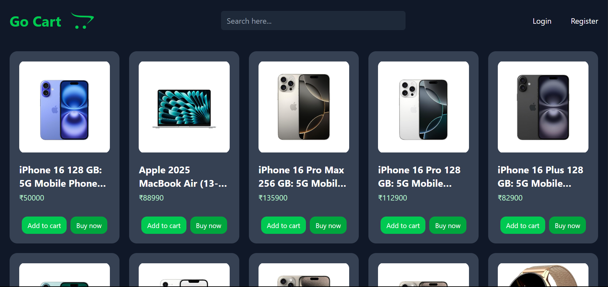

Project Title:

    Go Cart

Description:

    Go Cart is a full-stack e-commerce web application where users can browse products, add them to the cart, and place orders.

Demo:

Features:

    1. User Authentication & Authorization
        -User registration and login/logout
        -Secure password hashing and validation
        -Role-based access (e.g., admin, customer)

    2. Product Management
        -Browse and search products by category, price, or popularity
        -Product details page with images, descriptions, and reviews
        -Admin panel for adding, editing, or deleting products

    3. Shopping Cart
        -Add, update, or remove products in the cart
        -View cart summary with total price and quantity
        -Save cart state for logged-in users

    4. Responsive Design
        Fully responsive UI for desktop, tablet, and mobile

Tech Stack:

    backend:
        NodeJS + TypeScript
        ExpressJS
        
    frontend:
        React + vite + TypeScript
        TailwindCSS

    Authentication:
        JWT + bcrypt
    
    Database:
        MongoDB

Installation:

    npm install --save-dev typescript
    npm install --save-dev @types/node @types/react @types/react-dom
    npx tsc --init

API End Points:

    GET:
        /api/products
        /api/products/:id
        /api/cart  (users only)
        /api/auth/users (admins only)    

    POST:
        /api/products (admin only)
        /api/cart (users only)
        /api/auth/register
        /api/auth/login

    UPDATE:
        /api/products/:id   (admins only)

    DELETE:
        /api/products/:id   (admins only)

Folder Structure:

    |-  backend
    |-  frontend
    |-  .gitignore
    |-  README.nd

    backend:
        |- dist/
        |- src/
            |-  config/
                |-  db.ts
            |-  controllers/
                |-  cartController.ts
                |-  productController.ts
                |-  userController.ts
            |-  middleware/
                |-  authMiddleware.ts
            |-  models/
                |-  Cart.ts
                |-  Product.ts
                |-  User.ts
            |-  routes/
                |-  cartRoutes.ts
                |-  productRoutes.ts
                |-  userRoutes.ts
        |-  .env
        |-  index.ts

    frontend:

Info:

    Try Admin role by using Email: admin@gmail.com Password: admin@123

Contributing:

    Contributions are welcome! Please fork the repo and submit a pull request.